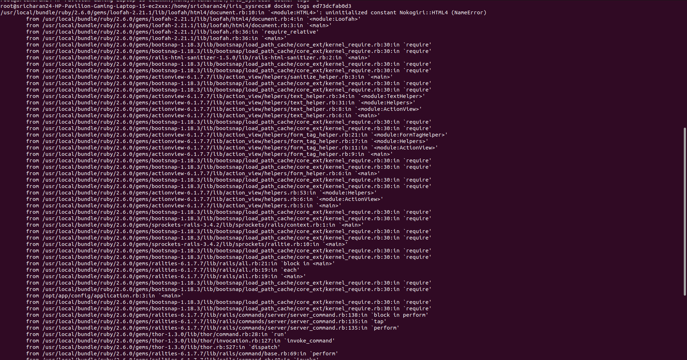
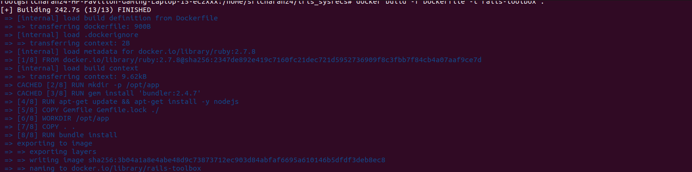
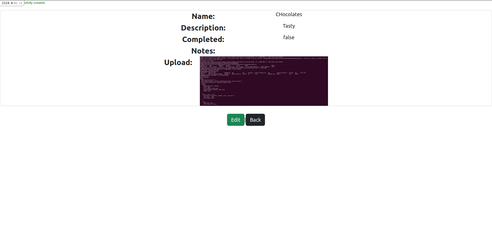

# Iris System Recruitments 2024
## Submission By Sricharan Sridhar (221IT066)

## Tasks Completed

* [X] Task 1
* [X] Task 2
* [X] Task 3
* [X] Task 4
* [X] Task 5
* [X] Task 6
* [X] Task 7
* [ ] Task 8


Bonus Tasks

* [ ] Task 1
* [ ] Task 2
* [ ] Task 3

## Note

The tasks completed are briefly explained here. For Documentation, refer the links for the tasks below :

* Task 1 : [task1.txt](task1.txt)
* Task 2 : [task2.txt](task2.txt)
* Task 3 : [task3.txt](task3.txt)
* Task 4 : [task4.txt](task4.txt)
* Task 5 : [task5.txt](task5.txt)
* Task 6 : [task6.txt](task6.txt)
* Task 7 : [task7.txt](task7.txt)

The following are the links for :

* Dockerfile : [Dockerfile](Dockerfile)
* Docker Compose file : [docker-compose.yml](docker-compose.yml)
* NginX Config file : [nginx.conf](nginx.conf)

## Task 1 - Packing the rails application in a docker container image

* Created a Dockerfile and built all the dependencies required from the Gemfile.
* Built a ruby:3.0.2 image initially, so I rebuilt the image for ruby:2.7.8 .
* Faced a lot of errors initially with the build, but eventually I changed versions of gems installed and the image was built.
* I was able to run a container on the image created.

Error in NodeJS version



Image Built Successfully



The list of images


Mistake in running container


## Task 2 - Launching the app in a container and linking it to a DB

* For this, I ran a container initially on the image created, and it ran successfully.
* I used the latest official image of mysql for this.
* I used docker compose to link the DB and the application.
* For a long time I faced errors with launching the application, and then problems with dependencies and the DB itself.
* After making changes in the Dockerfile and referring to the database.yml file, I was able to rectify it.
* I also had to install nodejs for the application to show the actual pages.
* The app was available on port 8080 and not 3000.

Creating an application container


MySQL Socket Error


Web Packer Error


Launching the Application on localhost 8080



Uploading a Task


## Task 3 - Using a NginX load balancer to recieve requests for the app

* For this, I used the official docker latest image of nginx.
* I created a configuration file to be able to listen from ports and balance accordingly.
* I also configured it as reverse proxy to the rails application.
* I was able to hear from port 8080 and now the app was able to be accessed only through the load balancer.

Checking on port 3000


Checking on port 8080


## Task 4 - Balancing requests among 3 containers of the app with a single DB

* For this, I created two more services in the docker-compose file for all 3 app containers.
* I also modified the config file of nginx to be able to listen from all the three containers at port 3000.
* The default was set to least connection proxy so I didnt mention that explicitly.
* I was able to hear from port 8080 and it balanced the request to an app container which had lesser load.

Launching the different services


Keeping three tabs open for three applications launched


## Task 5 - Enabling data persistence for the DB and nginx configuration files

* For this, I decided to use bind mounts.
* I created a directory called mysql-datab to store the data from the mysql directory.
* The nginx bind mount is included to store the changes in the file nginx.conf from the nginx directory.

mysql-datab directory after lauching the application


## Task 6 - Use Docker Compose to do this in one step

* I have been using docker compose from the second task onwards for this purpose.
* I have also made sure that I have built an image of the application and just referenced that image in the docker compose file so that it would not require to build the image everytime I attempt to create a network.

```
docker-compose up
#After Done with the application server launch
docker-compose down
```

## Task 7 - Limiting the number of HTTP requests in a given period of time

* To limit the number of http requests in a given period of time, I decided to add a request limit including the rate.
* I also named a zone as request_check to be accessed inside the server block of code.
* In the server block of code, I added burst value for the zone I created outside the block.

The two codes added are as follows : 
```
limit_req_zone $binary_remote_addr zone=request_check:10m rate=5r/s;

limit_req zone=request_check burst=10 nodelay;
```