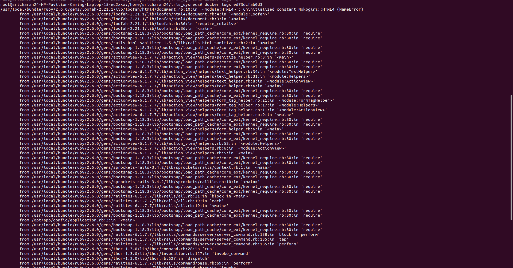
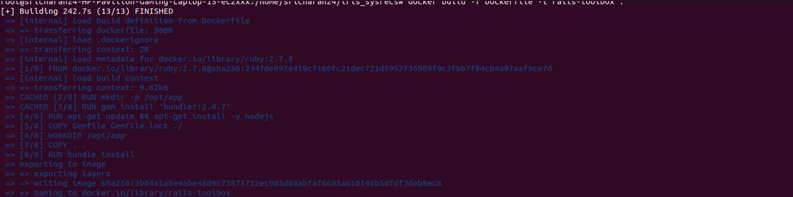
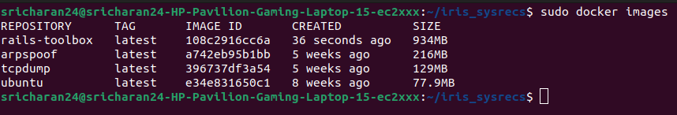
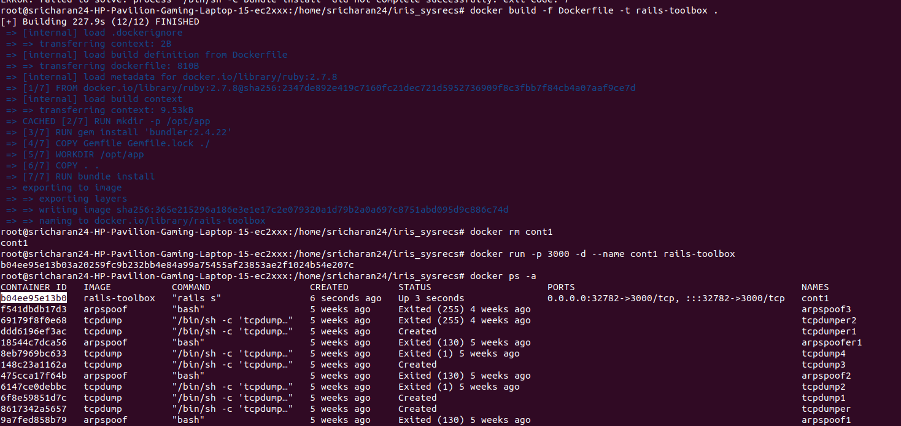

# DOCUMENTATION FOR THE COMPLETION OF TASK 1

## Name : Sricharan Sridhar
## Roll No. : 221IT066

# March 5th :

* For this task, I initially started reading about the entire set of tasks and understanding how the entire thing works.

## March 6th :

* I forked the repo and cloned it to the local system.
* I started making the Dockerfile, which was necessary to build the image for my application

INITIAL MISTAKES:
* I completely ignored the Gemfile and decided to just install a few dependencies on my own
* I also created an image for ruby version 3.1.2, but the app was running on ruby 2.6.1

* I later noticed that and changed the version to a 2.x.x version (2.7.8)
* I installed the gems from the Gemfile using RUN bundle install
* I figured that a newer bundler version needed to be installed, so I installed version 2.4.22 for the image
* I tried to build the image, but once I did and tried to run a container, I realised that NodeJS had to be installed

## March 7th : 

* I installed NodeJS through yarn package manager.
* I also installed yarn first and then the packages from yarn.
* I tried to create an entrypoint also (entrypoint.sh)
* The image was built successfully.

## FINAL CHECKS :-

* Build an image to pack the application (WORKS)

## Code

Dockerfile

```
#Creating a Dockerfile in the same location as the package.json file
#package.json is important in order to install the application dependencies. Dockerfile must be in the same location as it uses all files in the directory as context while building the image.


#Specifying the image to start with. Here we will start with the ruby image.
FROM ruby:2.7.8	AS rails-toolbox

# Creating an environment and making a default directory
ENV INSTALL_PATH /opt/app
RUN mkdir -p $INSTALL_PATH

#Setting the current working directory inside the container to the default directory made
WORKDIR /opt/app
COPY Gemfile Gemfile.lock package.json yarn.lock ./

RUN apt-get update && apt-get install nodejs yarn

# Installing bundler gem
RUN gem install rails bundler -v 2.4.22
COPY ..

# Installing all the gems from Gemfile
RUN bundle install

#Giving permissions to the entrypoint file.
RUN chmod +x ./entrypoint.sh

#Exposing port 3000 for the application
EXPOSE 3000

#Creating an Entrypoint for the Application
ENTRYPOINT ["./entrypoint.sh"]
```

## Screenshots

Error in NodeJS version



Image Built Successfully



The list of images



Mistake in running container




