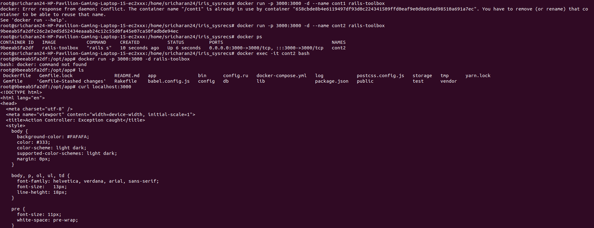
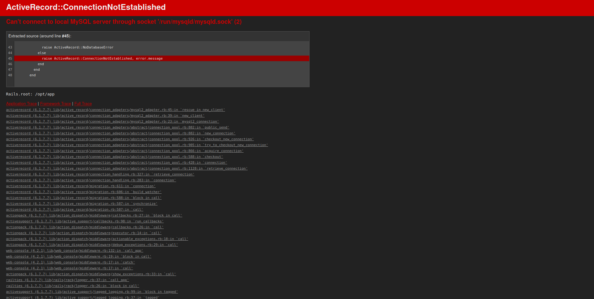
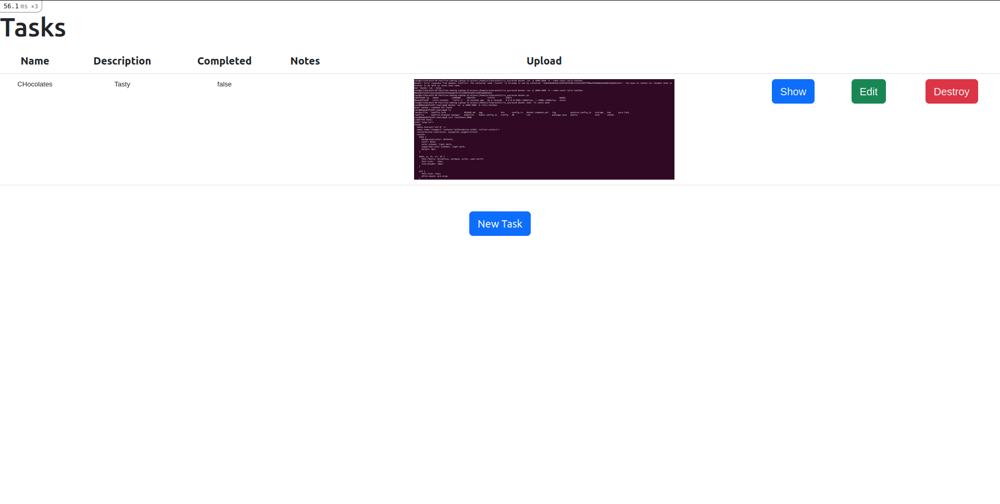

# DOCUMENTATION FOR THE COMPLETION OF TASK 2

## Name : Sricharan Sridhar
## Roll No. : 221IT066

## March 8th :

* I initially read about docker compose as i figured that inorder to link a DB with the application container, we would need to create a network.
* I tried to launch an application container by running the image built from task1. I was able to run it without errors.
* I tried to run the docker compose file by creating separate services for DB and the image
* Initially I was building the image everytime i ran docker compose.

MISTAKES

* I did not ensure the DB connectivity properly. Hence I was ending up with a MySQL socket error.
* I forgot to add environment variables, which were important in setting up the DB.
* I found them on database.yml file in the config directory.

## March 9th :

* I set up the environment variables. Initially I did not create a .env file to first ensure the DB was being set up properly.
* I got the error again. I tried initailizing the server again, trying out different versions of the sql server but I kept getting the error.
* I made changes to the env variables as there were some errors. I tried again and the db container was running properly when I tried docker compose.
* I noticed that the database was being created and tables were being created when the container was being run and the app was launched.

## March 10th :

* When I ran the application on port 8080, I got a new error, saying Webpacker wasnt writing into the manifest.json file.
* I tried reading online about the error and came across some sites asking to comment a line out of application.html.erb (in ./app/views/layouts)
* I tried it but was a bit skeptical as the code was to pack the application and ideally my webpacker should do that. The change didnt evade the error.
* I thought it could be because of some version error with the webpacker gem. I tried to install it again in the entrypoint file, but the error didnt change.

* I looked up about this online again and many asked to switch to rails 7.x.x version as it no longer uses webpacker. I tried but soon realized that it wouldnt change how the rails app is configured.

## March 11th :

* I tried to search up more on it and maybe figured that the manifest.json file was to be checked.
* I tried checking on it but wasnt getting anywhere.

* I tried to look up on the error by reading through the error lines while running docker compose. I noticed an error in Yarn.
* I tried reinstalling the nodejs and yarn package manager and the packages. After couple of tries and changes, it ended up loading the webpage.
* Initially I wasnt able to upload the file, but on running docker compose again, I was able to upload the file. I uploaded a file and took screenshots for this.

* The app was run on port 8080 and I didnt expose the app at port 3000, or the DB on port 3306.
* The application port 8080 was mapped to port 3000 and launched the app successfully.

## FINAL CHECKS :-

* Launch an Application Container (WORKS)
* Launch a separate container for the DB (WORKS)
* Connect the 2 containers (using docker-compose) (WORKS)
* DB is not exposed to the host or external network (WORKS)
* Application port is set to 8080 (WORKS)

## Code

Dockerfile

```
#Creating a Dockerfile in the same location as the package.json file
#package.json is important in order to install the application dependencies. Dockerfile must be in the same location as it uses all files in the directory as context while building the image.


#Specifying the image to start with. Here we will start with the ruby image.
FROM ruby:2.7.8	AS rails-toolbox

# Creating an environment and making a default directory
ENV INSTALL_PATH /opt/app
RUN mkdir -p $INSTALL_PATH

#Setting the current working directory inside the container to the default directory made
WORKDIR /opt/app
COPY Gemfile Gemfile.lock package.json yarn.lock ./

#Installing node js from yarn packages
RUN curl -sS https://dl.yarnpkg.com/debian/pubkey.gpg | apt-key add -
RUN echo "deb https://dl.yarnpkg.com/debian/ stable main" | tee /etc/apt/sources.list.d/yarn.list
RUN curl -sL https://deb.nodesource.com/setup_16.x -o /tmp/nodesource_setup.sh
RUN bash /tmp/nodesource_setup.sh

RUN apt-get update && apt-get install nodejs yarn
RUN yarn install --frozen-lockfile

# Installing bundler gem
RUN gem install rails bundler -v 2.4.22
COPY ..

# Installing all the gems from Gemfile
RUN bundle install

#Giving permissions to the entrypoint file.
RUN chmod +x ./entrypoint.sh

#Exposing port 3000 for the application
EXPOSE 3000

#Creating an Entrypoint for the Application
ENTRYPOINT ["./entrypoint.sh"]
```

Docker Compose file

```
version: '3'

services:
  #Image for the DB. Using MySQL latest official image from Docker here.
  mysqldb:
    image : mysql:latest
    container_name : db2
    environment :                       #enviroment variables are taken from .env file
      MYSQL_USER : ${db_user}           
      MYSQL_ROOT_PASSWORD : ${root_pwd}
      MYSQL_PASSWORD : ${db_password}
      MYSQL_DATABASE : ${db_name}
      
#Image for the App. Using a pre built image so that we dont need to re build everytime.
  web :
    image : railsapp
    command : "rails server -b 0.0.0.0"
    environment :
      RAILS_ENV : ${app_env}

    #Adding a dependency on the DB to create a network link
    depends_on :
      - mysqldb
```

## Screenshots

Creating an application container



MySQL Socket Error



Web Packer Error


Launching the Application on localhost 8080


Uploading a Task

