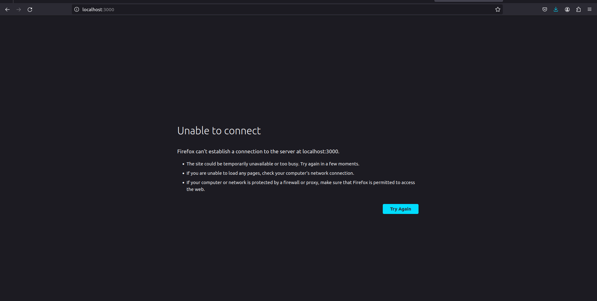
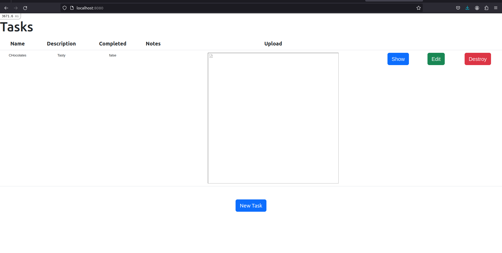

# DOCUMENTATION FOR THE COMPLETION OF TASK 3

## Name : Sricharan Sridhar
## Roll No. : 221IT066

## March 12th : 

* I decided to read about nginx load balancing. I also read about reverse proxy to figure out what it actually is.
* I decided to use the latest image of nginx which is an official docker image.
* I added a dependency such that the nginx container would depend on the app container, creating a link.

* I initially made a Dockerfile for nginx to create the image, but I figured it wouldnt be needed if im just using the official image.
* I also created a nginx config file (nginx.conf), to configure what the load balancer does.

* It would read on port 8080 (application port) and map it to port 80.
* I configured the load balancer as reverse proxy to the rails application.
* The load balancer would listen on port 80 and load the application container, which in turn would launch the page.

* On creating a network using docker compose, I was able to acheive this.

## FINAL CHECKS :-

* Access the application through the load balancer on port 8080 (WORKS)
* Cannot directly access the application (WORKS)

## Code

Dockerfile
```
#Creating a Dockerfile in the same location as the package.json file
#package.json is important in order to install the application dependencies. Dockerfile must be in the same location as it uses all files in the directory as context while building the image.


#Specifying the image to start with. Here we will start with the ruby image.
FROM ruby:2.7.8	AS rails-toolbox

# Creating an environment and making a default directory
ENV INSTALL_PATH /opt/app
RUN mkdir -p $INSTALL_PATH

#Setting the current working directory inside the container to the default directory made
WORKDIR /opt/app
COPY Gemfile Gemfile.lock package.json package.json ./

#Installing node js from yarn packages
RUN curl -sS https://dl.yarnpkg.com/debian/pubkey.gpg | apt-key add -
RUN echo "deb https://dl.yarnpkg.com/debian/ stable main" | tee /etc/apt/sources.list.d/yarn.list
RUN curl -sL https://deb.nodesource.com/setup_16.x -o /tmp/nodesource_setup.sh
RUN bash /tmp/nodesource_setup.sh

RUN apt-get update && apt-get install nodejs yarn
RUN yarn install --frozen-lockfile

# Installing bundler gem
RUN gem install rails bundler -v 2.4.22
COPY ..

# Installing all the gems from Gemfile
RUN bundle install

#Giving permissions to the entrypoint file.
RUN chmod +x ./entrypoint.sh

#Exposing port 3000 for the application
EXPOSE 3000

#Creating an Entrypoint for the Application
ENTRYPOINT ["./entrypoint.sh"]

```

Docker Compose file
```
version: '3'

services:
  #Image for the DB. Using MySQL latest official image from Docker here.
  mysqldb:
    image : mysql:latest
    container_name : db2
    environment :                       #enviroment variables are taken from .env file
      MYSQL_USER : ${db_user}           
      MYSQL_ROOT_PASSWORD : ${root_pwd}
      MYSQL_PASSWORD : ${db_password}
      MYSQL_DATABASE : ${db_name}
      
#Image for the App. Using a pre built image so that we dont need to re build everytime.
  web1 :
    image : railsapp
    command : "rails server -b 0.0.0.0"
    environment :
      RAILS_ENV : ${app_env}

    #Adding a dependency on the DB to create a network link
    depends_on :
      - mysqldb

#NginX image for load balancer. The official image from Docker is used here.      
  nginx :
    image : nginx:latest
    volumes : 	
      - ./nginx.conf:/etc/nginx/conf.d/default.conf   #Adding bind mount for the config files
    #Adding Dependency on the application.
    depends_on :
      - web1
    #Exposing on application port 8080, mapped to port 80.  
    ports :
      - "8080:80" 

```

Nginx Config file
```
http{
 	upstream railsapplication {
		server web1:3000;
	}
	
	server {
	    listen 80;

	    location / {
	        proxy_pass http://railsapplication;
	        proxy_set_header Host $host;
	        proxy_set_header X-Real-IP $remote_addr;
	        proxy_set_header X-Forwarded-For $proxy_add_x_forwarded_for;
	        proxy_set_header X-Forwarded-Proto $scheme;
	    }
	}
}
```

## Screenshots

Checking on port 3000



Checking on port 8080

