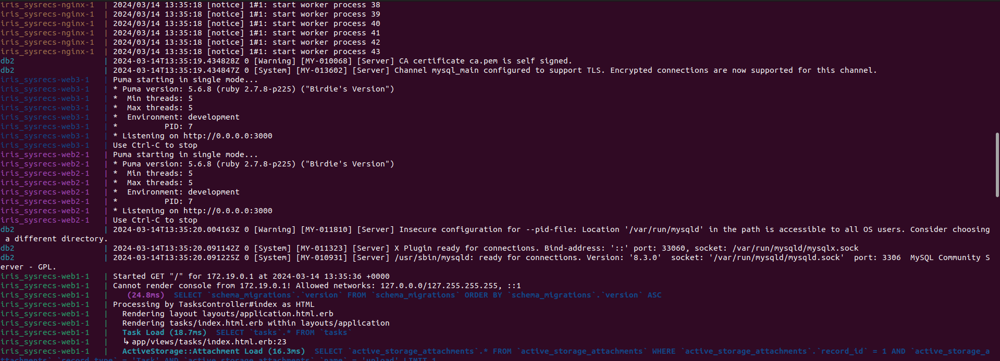
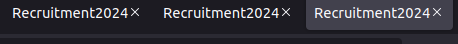

# DOCUMENTATION FOR THE COMPLETION OF TASK 4

## Name : Sricharan Sridhar
## Roll No. : 221IT066

## March 13th : 

* I decided to read about how to be able to launch three application images from a single Load balancer.
* I initially assumed we could define how many containers we would want to create from a single image in the docker compose file.
* I figured that it was better to just create three different services for each of the applications to be launched.

* I made sure all three depend on the same DB, that is the mysqldb.
* I also made sure that the load balancer (nginx) would depend on all three application services.

* I decided to make changes in the config file of nginx (nginx.conf), creating an upstream for all the three apps.
* This would listen to requests and balance the load between the three applications at port 3000.
* It was default with least_conn (least connections priority)

* On creating the network using docker compose, the three application servers, DB and the nginx servers launched and I was able to balance the load between the three application containers.

## FINAL CHECKS :-

* Created three services for the application (WORKS)
* Link all three images to a single DB (WORKS)
* Link the load balancer to the three application services (WORKS)
* Access the application only from port 8080 (WORKS)

## Code

Dockerfile
```
#Creating a Dockerfile in the same location as the package.json file
#package.json is important in order to install the application dependencies. Dockerfile must be in the same location as it uses all files in the directory as context while building the image.


#Specifying the image to start with. Here we will start with the ruby image.
FROM ruby:2.7.8	AS rails-toolbox

# Creating an environment and making a default directory
ENV INSTALL_PATH /opt/app
RUN mkdir -p $INSTALL_PATH

#Setting the current working directory inside the container to the default directory made
WORKDIR /opt/app
COPY Gemfile Gemfile.lock package.json yarn.lock ./

#Installing node js from yarn packages
RUN curl -sS https://dl.yarnpkg.com/debian/pubkey.gpg | apt-key add -
RUN echo "deb https://dl.yarnpkg.com/debian/ stable main" | tee /etc/apt/sources.list.d/yarn.list
RUN curl -sL https://deb.nodesource.com/setup_16.x -o /tmp/nodesource_setup.sh
RUN bash /tmp/nodesource_setup.sh

RUN apt-get update && apt-get install nodejs yarn
RUN yarn install --frozen-lockfile

# Installing bundler gem
RUN gem install rails bundler -v 2.4.22
COPY ..

# Installing all the gems from Gemfile
RUN bundle install

#Giving permissions to the entrypoint file.
RUN chmod +x ./entrypoint.sh

#Exposing port 3000 for the application
EXPOSE 3000

#Creating an Entrypoint for the Application
ENTRYPOINT ["./entrypoint.sh"]
```

Docker Compose File
```
version: '3'

services:
  #Image for the DB. Using MySQL latest official image from Docker here.
  mysqldb:
    image : mysql:latest
    container_name : db2
    environment :                       #enviroment variables are taken from .env file
      MYSQL_USER : ${db_user}           
      MYSQL_ROOT_PASSWORD : ${root_pwd}
      MYSQL_PASSWORD : ${db_password}
      MYSQL_DATABASE : ${db_name}
      
#First image for the App. Using a pre built image so that we dont need to re build everytime.
  web1 :
    image : railsapp
    command : "rails server -b 0.0.0.0"
    environment :
      RAILS_ENV : ${app_env}

    #Adding a dependency on the DB to create a network link
    depends_on :
      - mysqldb
      
#Second image for the app.     
  web2 :
    image : railsapp
    command : "rails server -b 0.0.0.0"
    environment :
      RAILS_ENV : ${app_env}
    depends_on :
      - mysqldb

#Third image for the app.
  web3 :
    image : railsapp
    command : "rails server -b 0.0.0.0"
    environment :
      RAILS_ENV : ${app_env}
    depends_on :
      - mysqldb

#NginX image for load balancer. The official image from Docker is used here.      
  nginx :
    image : nginx:latest
    volumes : 	
      - ./nginx.conf:/etc/nginx/conf.d/default.conf   #Adding bind mount for the config files
    #Adding Dependency on all three applications.
    depends_on :
      - web1
      - web2
      - web3
    #Exposing on application port 8080, mapped to port 80.  
    ports :
      - "8080:80" 
```

Nginx Conf File
```
http{
 	upstream railsapplication {
		server web1:3000;
		server web2:3000;
		server web3:3000;
	}
		
	server {
	    listen 80;

	    location / {
	        proxy_pass http://railsapplication;
	        proxy_set_header Host $host;
	        proxy_set_header X-Real-IP $remote_addr;
	        proxy_set_header X-Forwarded-For $proxy_add_x_forwarded_for;
	        proxy_set_header X-Forwarded-Proto $scheme;
	    }
	}
}
```

## Screenshots

Launching the different services




Keeping three tabs open for three applications launched


