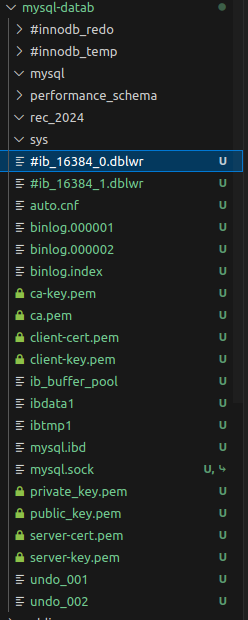

# DOCUMENTATION FOR THE COMPLETION OF TASK 5

## Name : Sricharan Sridhar
## Roll No. : 221IT066

## March 14th :

* I had initially gone through info about volume mount and bind mounts.
* I assumed it would be better to go ahead with volume mounts since it would just save everything to the Docker Directory.
* I had incluede a volume for the database named mysql-data and assumed the task was done.

## March 16th : 

* When I was having a check of the tasks completed, I was confused a bit about the data persistence.
* I read online and figured that having a volume mount will in turn make me create the volume again and again when the network is created using docker compose.
* It would be no use to have this done as the data is not stored.

* So I created a directory named mysql-datab.
* This would store all data that changes in the mysql directory -> /var/lib/mysql

* I also created a bind mount for the NginX config files.
* This would store data that changes in the nginx directory -> /etc/nginx/conf.d/default.conf

## FINAL CHECKS :-

* Created a Bind mount for the DB (WORKS)
* Created a Bind mount for the NginX config files (WORKS)

## Code

Dockerfile
```
#Creating a Dockerfile in the same location as the package.json file
#package.json is important in order to install the application dependencies. Dockerfile must be in the same location as it uses all files in the directory as context while building the image.


#Specifying the image to start with. Here we will start with the ruby image.
FROM ruby:2.7.8	AS rails-toolbox

# Creating an environment and making a default directory
ENV INSTALL_PATH /opt/app
RUN mkdir -p $INSTALL_PATH

#Setting the current working directory inside the container to the default directory made
WORKDIR /opt/app
COPY Gemfile Gemfile.lock package.json package.json ./

#Installing node js from yarn packages
RUN curl -sS https://dl.yarnpkg.com/debian/pubkey.gpg | apt-key add -
RUN echo "deb https://dl.yarnpkg.com/debian/ stable main" | tee /etc/apt/sources.list.d/yarn.list
RUN curl -sL https://deb.nodesource.com/setup_16.x -o /tmp/nodesource_setup.sh
RUN bash /tmp/nodesource_setup.sh

RUN apt-get update && apt-get install nodejs yarn
RUN yarn install --frozen-lockfile

# Installing bundler gem
RUN gem install rails bundler -v 2.4.22
COPY ..

# Installing all the gems from Gemfile
RUN bundle install

#Giving permissions to the entrypoint file.
RUN chmod +x ./entrypoint.sh

#Exposing port 3000 for the application
EXPOSE 3000

#Creating an Entrypoint for the Application
ENTRYPOINT ["./entrypoint.sh"]
```

Docker Compose File
```
version: '3'

services:
  #Image for the DB. Using MySQL latest official image from Docker here.
  mysqldb:
    image : mysql:latest
    container_name : db2
    volumes :
      - ./mysql-datab:/var/lib/mysql    #Adding a bind mount for the DB persistence
    environment :                       #enviroment variables are taken from .env file
      MYSQL_USER : ${db_user}           
      MYSQL_ROOT_PASSWORD : ${root_pwd}
      MYSQL_PASSWORD : ${db_password}
      MYSQL_DATABASE : ${db_name}
      
#First image for the App. Using a pre built image so that we dont need to re build everytime.
  web1 :
    image : railsapp
    command : "rails server -b 0.0.0.0"
    environment :
      RAILS_ENV : ${app_env}

    #Adding a dependency on the DB to create a network link
    depends_on :
      - mysqldb
      
#Second image for the app.     
  web2 :
    image : railsapp
    command : "rails server -b 0.0.0.0"
    environment :
      RAILS_ENV : ${app_env}
    depends_on :
      - mysqldb

#Third image for the app.
  web3 :
    image : railsapp
    command : "rails server -b 0.0.0.0"
    environment :
      RAILS_ENV : ${app_env}
    depends_on :
      - mysqldb

#NginX image for load balancer. The official image from Docker is used here.      
  nginx :
    image : nginx:latest
    volumes : 	
      - ./nginx.conf:/etc/nginx/conf.d/default.conf   #Adding bind mount for the config files
    #Adding Dependency on all three applications.
    depends_on :
      - web1
      - web2
      - web3
    #Exposing on application port 8080, mapped to port 80.  
    ports :
      - "8080:80" 
```

Nginx Conf File
```
http{
 	upstream railsapplication {
		server web1:3000;
		server web2:3000;
		server web3:3000;
	}
		
	server {
	    listen 80;

	    location / {
	        proxy_pass http://railsapplication;
	        proxy_set_header Host $host;
	        proxy_set_header X-Real-IP $remote_addr;
	        proxy_set_header X-Forwarded-For $proxy_add_x_forwarded_for;
	        proxy_set_header X-Forwarded-Proto $scheme;
	    }
	}
}
```

## Screenshots

mysql-datab directory after lauching the application

